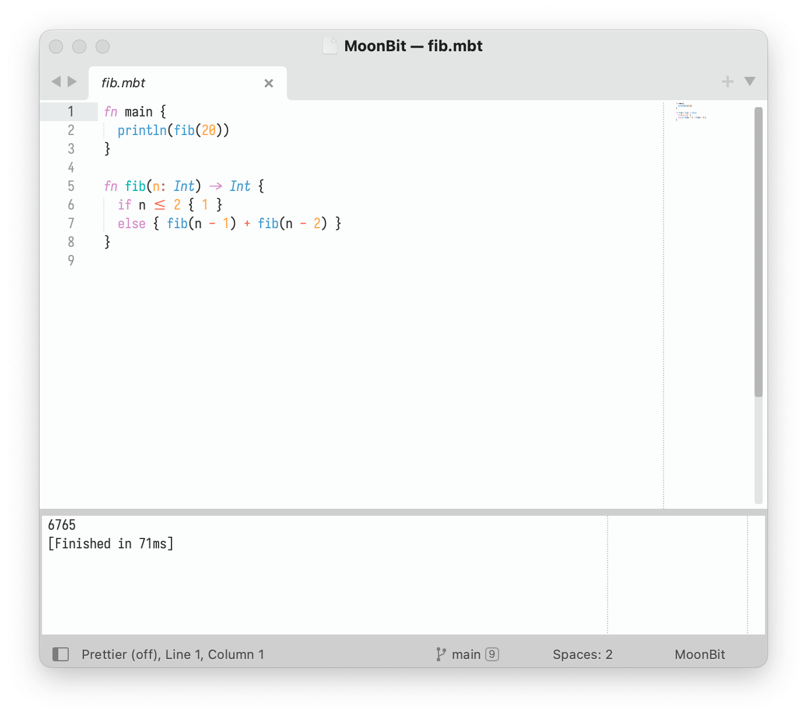
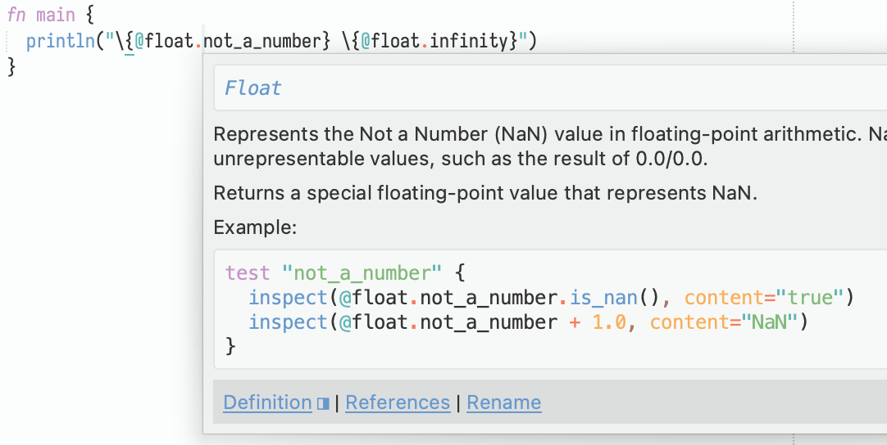

# MoonBit Syntax Highlight

[](./LICENSE.txt)
[](https://www.sublimetext.com/blog/articles/sublime-text-4)

<p align="center">
  <picture>
    <source media="(prefers-color-scheme: dark)" srcset="./images/screenshot-dark.png">
    <source media="(prefers-color-scheme: light)" srcset="./images/screenshot-light.png">
    
  </picture>
</p>

## Install

- Via Package Control: search for `MoonBit`.
- Manual: clone this repo into your Sublime `Packages` folder.

## LSP Configuration

1. Make sure you have installed the sublime [LSP](https://github.com/sublimelsp/LSP) plugin.
2. Open `Preferences: LSP Settings` from the command palette.
3. Add a new LSP server to the `"clients"` field.

```jsonc
// Settings in here override those in "LSP/LSP.sublime-settings"
{
  "clients": {
    "moonbit-lsp": {
      "enabled": true,
      "command": ["/Users/yourname/.moon/bin/lsp-server.js"],
      "selector": "source.moonbit"
    }
  },
}
```

`"/Users/yourname/.moon/bin/lsp-server.js"` is the place where moonbit places its LSP server.
It is an executable on Mac/Linux. But on Windows you may need to change the `"command"` to something like

```jsonc
"command": ["node", "C:\\Users\\yourname\\.moon\\bin\\lsp-server.js"],
```

## Add Syntax Highlighting to Hover Popups

<p align="center">
  <picture>
    <source media="(prefers-color-scheme: dark)" srcset="./images/popup-dark.png">
    <source media="(prefers-color-scheme: light)" srcset="./images/popup-light.png">
    
  </picture>
</p>

Sublime LSP uses [MdPopups](https://facelessuser.github.io/sublime-markdown-popups/settings/#mdpopupssublime_user_lang_map) to render the hovering documentations, add the following config to your global preferences (`Preferences: settings` from the command palette) to enable it.

```jsonc
"mdpopups.sublime_user_lang_map": {
  "moonbit": [["moonbit", "mbti", "mbt"], ["MoonBit/MoonBit"]]
}
```

## License

MIT @ [hyrious](https://github.com/hyrious)
